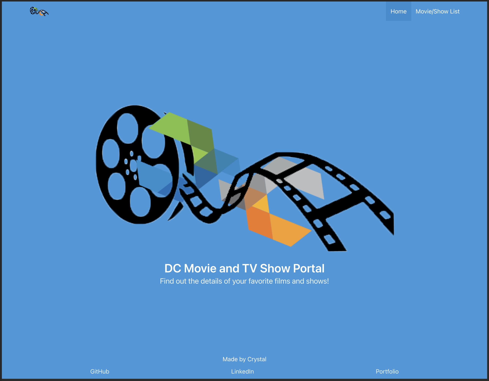
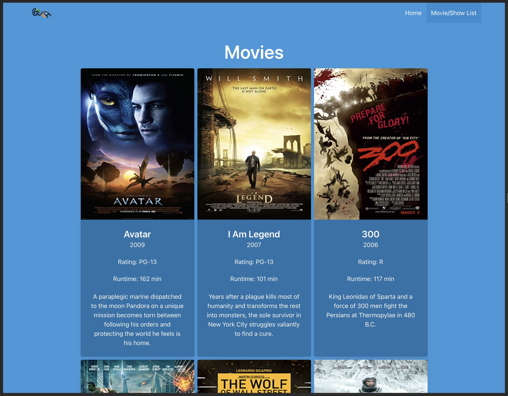

# Practice: Express Server and es6 Engine

This is a webpage and allows users to get information about many popular movies and TV Shows.

## Decription

This was a practice in creating an express server with an es6 engine. It was also an exploration into linking Bulma with the html using partials.

## Motivation

- To continue the practice of Express and es6 on a broader scale than previous exercises.
- To create a fully usable and styled page.

## Challenges and Solutions

- Integrating Bulma into the site.
  - Done using a seperate head file and partials.
  - Continued to use Bulma's documentation to explore new solutions to CSS problems.
- Using the link to the image posters.
  - Image posters did not all have an https address.
  - Used replace to exchange http: for https:.

## Screenshots

## Credits

Thank you to DigitalCrafts for the exercise, Sean for the guidance and the data, and the GameRoom for the fun.
